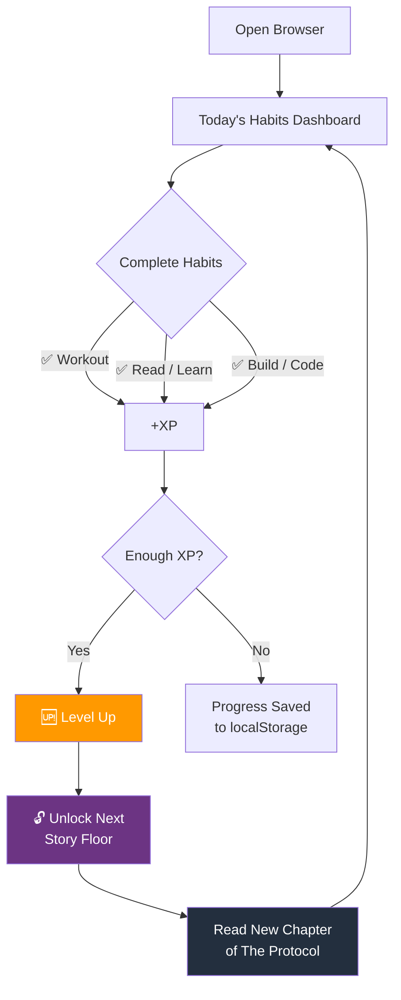

<div align="center">

# ⚔️ HAKAI PROTOCOL

### A gamified self-improvement system disguised as a browser RPG

[](.)
[](.)
[](.)
[](.)
[](.)

<br/>

```
╔═══════════════════════════════════════════════════════╗
║  FLOOR 1 ░░░░░░░░░░░░░░░░░░░░░░░░░░░░░░  FLOOR 30   ║
║  The Glitch ──── Awakening ──── The Protocol ──────▶  ║
║                                                       ║
║  Complete your habits. Unlock the story. Level up.    ║
╚═══════════════════════════════════════════════════════╝
```

</div>

---

## 🧠 What Is This?

**HAKAI PROTOCOL** is a browser-based habit tracker wrapped in a narrative RPG. Every day you complete your habits — workout, reading, coding — you earn XP, level up, and unlock the next floor of a 30-chapter story about discipline, systems thinking, and self-mastery.

No app store. No account. No subscription. Open `index.html` in Chrome. That's it.

> *"Power is shaped by consistency."* — Floor 5

---

## 🎮 How It Works



---

## 📖 The 30-Floor Story

The narrative unfolds as you earn XP — one floor per milestone. Each floor is a short philosophical chapter about the nature of systems, discipline, and personal evolution.

| Floors | Arc | Theme |
|:---:|:---:|:---|
| 1–5 | **The Awakening** | Noticing the glitch. Choosing to engage. |
| 6–10 | **Resistance** | The mind fights back. Discipline hurts. |
| 11–15 | **The Mechanism** | Understanding that identity is programmable. |
| 16–20 | **Deep Systems** | Pattern recognition. Compounding behavior. |
| 21–25 | **The Protocol** | Mastery of the self as an operating system. |
| 26–30 | **Transcendence** | Beyond the interface. You become the system. |

---

## ⚙️ Features

<table>
<tr>
<td width="50%">

**📅 Daily Habit Tracking**
- Workout
- Read / Learn
- Build / Code
- Custom habits (configurable)

**⚡ XP & Level System**
- Earn XP per completed habit
- Levels unlock story floors
- Daily streaks compound rewards

</td>
<td width="50%">

**🗺️ Story Progression**
- 30 narrative nodes
- Unlocks tied to real-world progress
- Philosophical + motivational writing

**💾 Zero-Dependency Persistence**
- All state saved in `localStorage`
- No login, no backend, no cloud
- Progress survives browser restarts

</td>
</tr>
</table>

---

## 🛠️ Tech Stack

| Layer | Detail |
|:---|:---|
| **Language** | Vanilla JavaScript (ES6+) — no frameworks, no dependencies |
| **Storage** | `localStorage` — XP, level, daily progress, story state |
| **Rendering** | Pure DOM manipulation — dynamic habit cards, XP bars, story panels |
| **Style** | Custom CSS — dark cyberpunk aesthetic, animated transitions |
| **Assets** | Custom character artwork (`striker_jk.png`, `cath_gems.png`) |
| **Deployment** | Zero — open `index.html` directly in any browser |

---

## 🚀 Run It

```bash
# Option 1 — just open it
# Double-click index.html in Chrome/Firefox

# Option 2 — serve locally for dev
npx serve .
# Open http://localhost:3000
```

No npm install. No build step. No configuration.

---

## 🎨 Game Structure

```
hakai-protocol/
├── index.html          # Main game interface
├── intro.html          # Opening narrative / character select
├── select.html         # Character selection screen
├── main.js             # Game engine — habits, XP, story, state
├── style.css           # Full game styling
├── striker_jk.png      # Character artwork
├── cath_gems.png       # Character artwork
├── hakai_world.png     # World background
└── Hakaiworld-2.png    # World background variant
```

---

## 💡 Why I Built This

Habit apps are boring. Tracking streaks in a spreadsheet doesn't motivate anyone. The idea here was to make the *act of self-improvement* feel like progressing through a game — because the psychology of games (reward loops, narrative stakes, level-up dopamine) is exactly what makes habits stick.

The 30-floor story structure mirrors the actual experience of building discipline: it starts with discomfort, moves through resistance, and eventually becomes identity.

---

## 💡 Skills Demonstrated

| Skill | Detail |
|:---|:---|
| 🎮 **Game Loop Design** | Daily XP cycle, level gates, story unlock triggers |
| 💾 **State Management** | Full app state in localStorage — no backend, no data loss |
| 🎨 **UI/UX Design** | Custom game aesthetic from scratch in pure CSS |
| 📖 **Narrative Design** | 30-floor progressive story arc tied to real-world behavior |
| ⚡ **Vanilla JS** | Zero dependencies — all DOM, event handling, and state logic |

---

<div align="center">

**Built by [Jeevan Kumar](https://github.com/Jeevan-0508)**

*The system rewards those who show up.*

</div>
